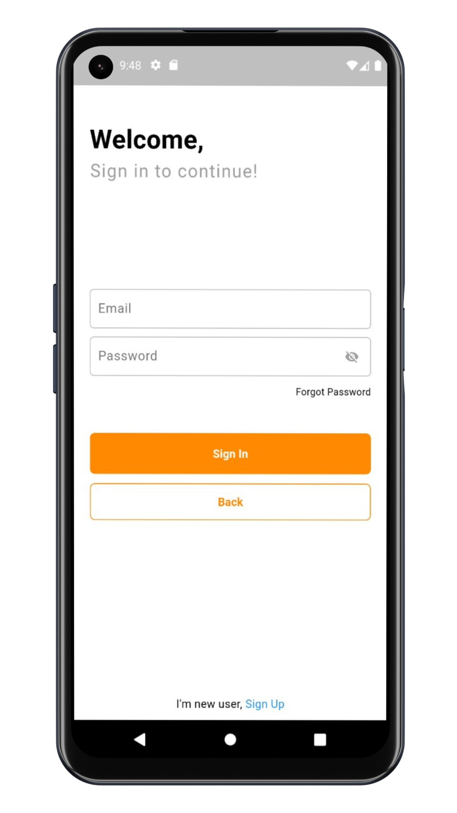
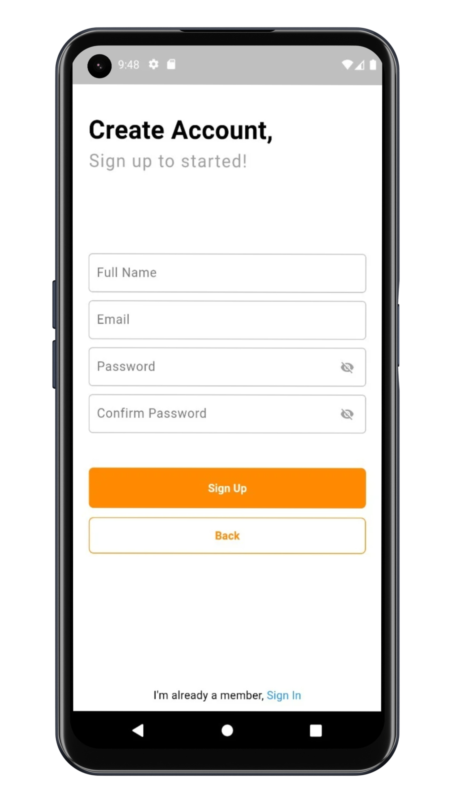
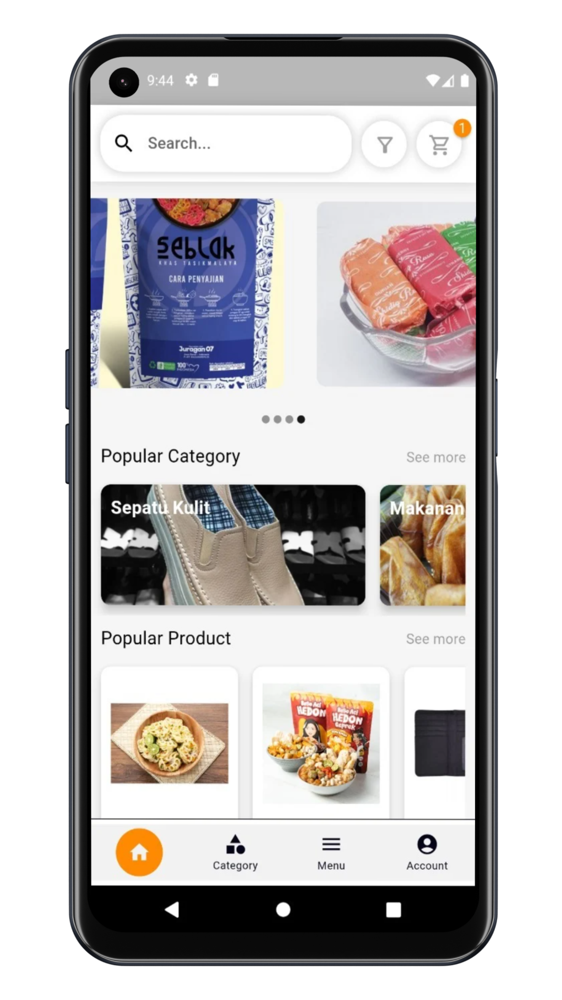
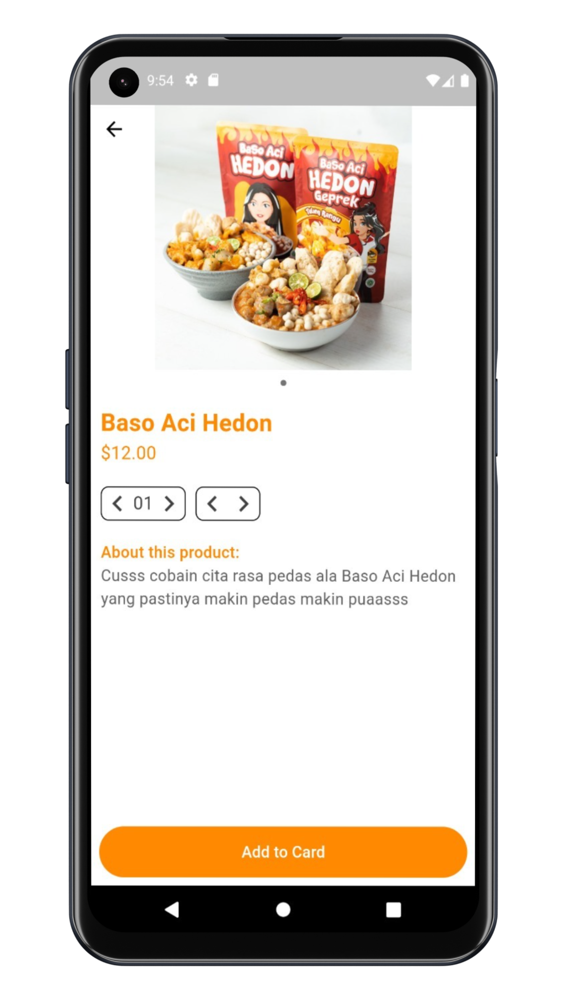
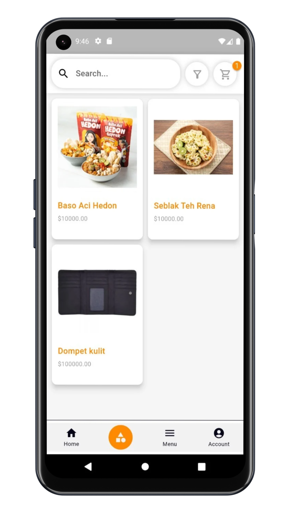
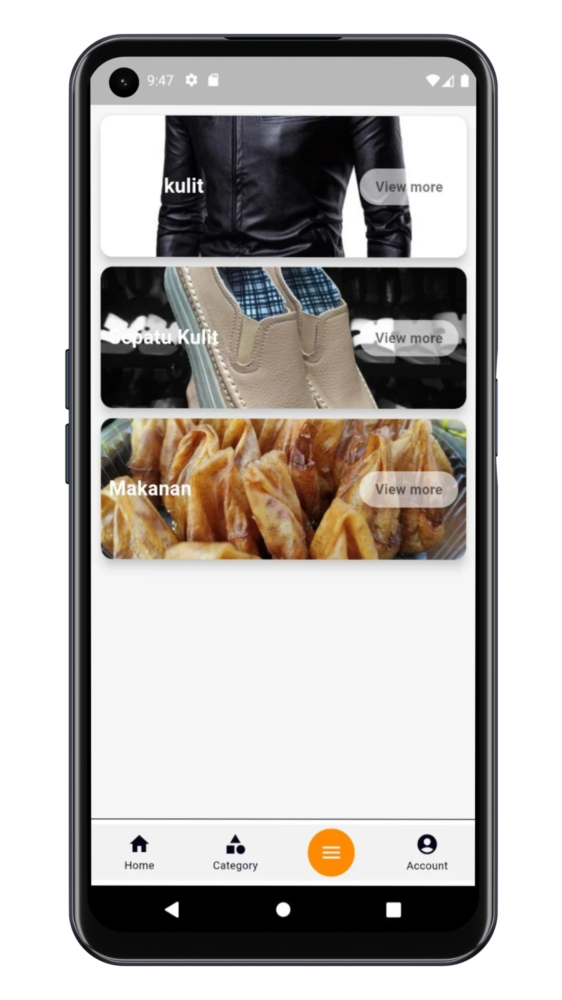
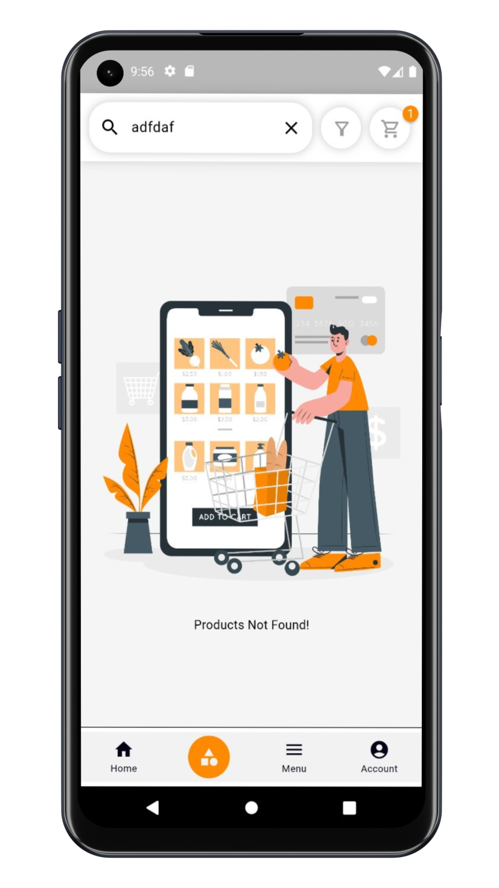
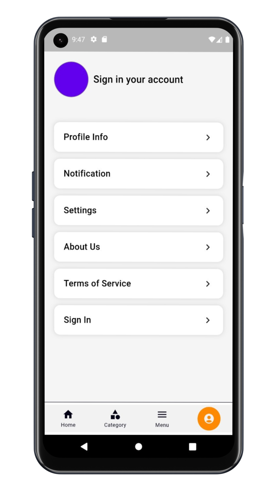

# TEAM 5

- Wahyu Bunyamin (2106064)
- Fauzan Romi Juliansyah (2106150)
- Fernuzuar Faiz Zahran (2106012)

# NotesApp Mobile

Aplikasi Karya Garut adalah portal e-commerce yang mempersembahkan kekayaan budaya dan warisan lokal dari Kabupaten Garut secara eksklusif. Dibangun dengan cinta dan dedikasi untuk mempromosikan keindahan serta keunikan kota Garut, aplikasi ini menjadi tempat yang sempurna bagi para pecinta kuliner, kerajinan tangan, dan produk-produk lokal Garut.
Tidak hanya sebagai platform e-commerce, Aplikasi Karya Garut juga berperan sebagai wadah bagi para pelaku usaha lokal Garut untuk memperluas jangkauan pasar mereka. Dengan memanfaatkan teknologi digital, aplikasi ini memungkinkan mereka untuk terhubung langsung dengan konsumen, menghadirkan pengalaman belanja yang nyaman dan menyenangkan.

## Features

- **Registrasi**: Fitur ini memungkinkan pengguna untuk membuat akun pribadi di aplikasi, yang dapat mereka gunakan untuk mengakses semua fitur dan menyimpan informasi profil serta riwayat transaksi.
- **Deskripsi Produk**: Setiap produk memiliki halaman deskripsi yang lengkap dengan informasi mengenai bahan baku, cara pembuatan, serta cerita di balik produk tersebut.
- **Kategori Produk**: pengguna dapat melihat beberapa produk berdasarkan kategori yang diberikan. ini lebih mempermudah saat pemcarian produk.
- **Profile Pengguna**: Pengguna dapat mengelola informasi pribadi mereka, termasuk alamat pengiriman dan metode pembayaran yang disimpan, untuk memudahkan proses pembelian di masa mendatang.
- **Pencarian Produk**: Pengguna dapat mencari produk-produk yang mereka inginkan berdasarkan kata kunci.

## Technologies Used

### Frontend
- **Dart**: Bahasa pemrograman yang dikembangkan oleh Google. Ia digunakan untuk membangun aplikasi berbasis web dan seluler.
- **Flutter**: Kerangka kerja (framework) open source dari Google untuk membuat antarmuka pengguna yang responsif dan menarik 

### Backend
- **sqllite**: Menyimpan data secara lokal dalam aplikas. 
- **Stapi**: Mengelola konten dalam proyek dan memungkinkan mengaksesnya melalui API

## Project Thumbnail 

    
    &nbsp;&nbsp;
    
    &nbsp;&nbsp;
    
    &nbsp;&nbsp;
    
    &nbsp;&nbsp;
    
    &nbsp;&nbsp;
    
    &nbsp;&nbsp;
    
    &nbsp;&nbsp;
    

